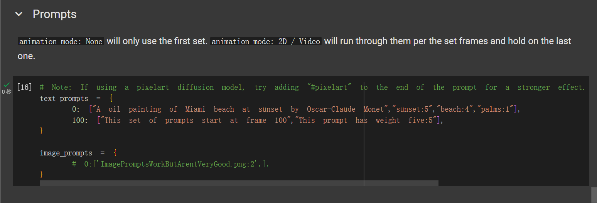
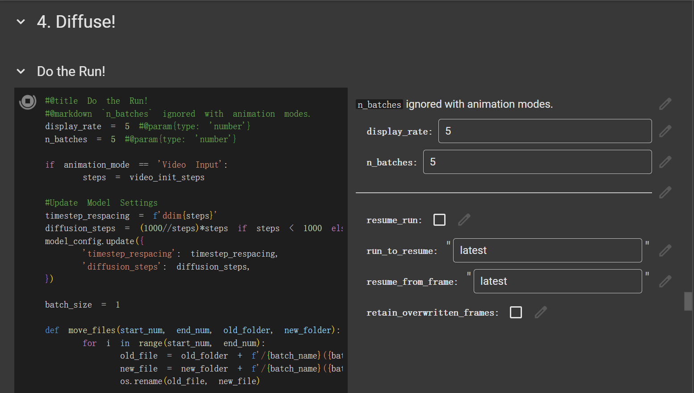
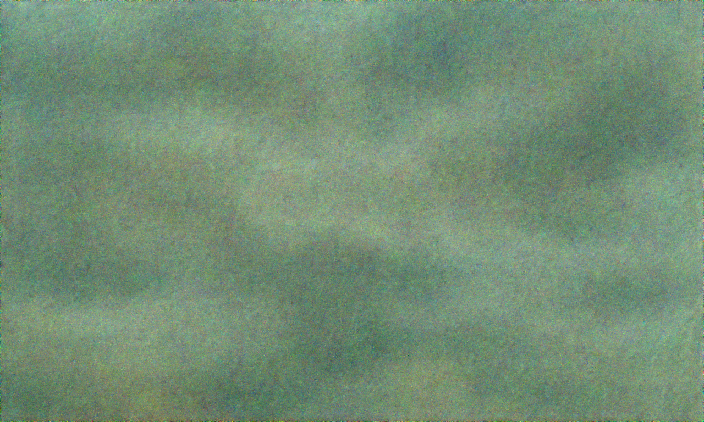
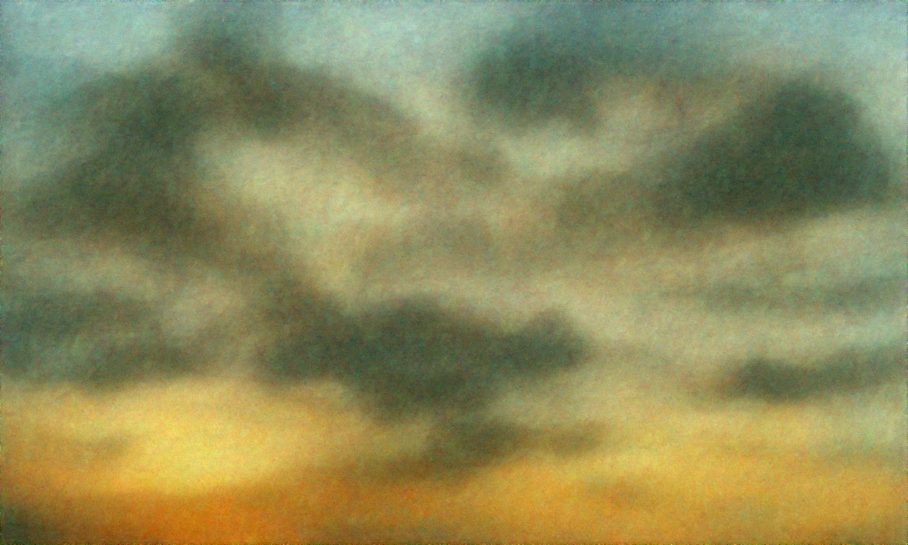
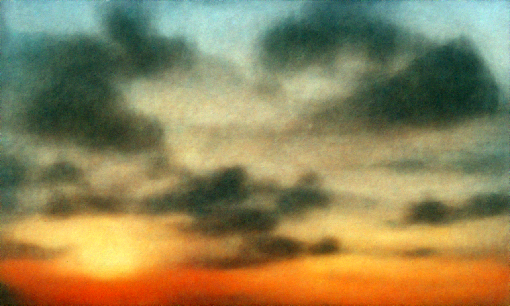

# McSirius Disco Diffusion

## Overview

This project is based on GPT 4.0 and web crawlers to search for hot keywords and images on the network. Through big data analysis of word frequency and hotspot level, it trains the AI training-set for Disco Diffusion to achieve a constantly self iterating AIGC creative image generation system.
This project runs on [google colab](https://colab.research.google.com/). Click [here](https://colab.research.google.com/drive/1X8llzvDz2a2AOwpVkCGbWsFrgk4XGTSq) for preview.

## Modules & Folder directory

|Modules|Folder directory|Description|
|--|--|--|
|AI|/AI|code of AIGC part|
||/AI/Disco_Diffusion|code of disco diffusion|
||/AI/Disco_Diffusion/images_out|output of images|
||/AI/Disco_Diffusion/init_images|AIGC benchmark graph, used for AI diffusion and generation of new graphs|
||/AI/Disco_Diffusion/models|Sets of Diffusion Algorithm|
|Colab Notebooks|/Colab Notebooks|the runtime script of disco diffusion on google colab|

## Usage and Effect

#### Prompts

Input ideas and keywords to AI to generate images.

#### Diffuse!

Now, set the parameters of diffusion.
AI will diffuse the ideas and keywords and start to generate the images.

Output

## Thanks

小伟 @carlblocking
